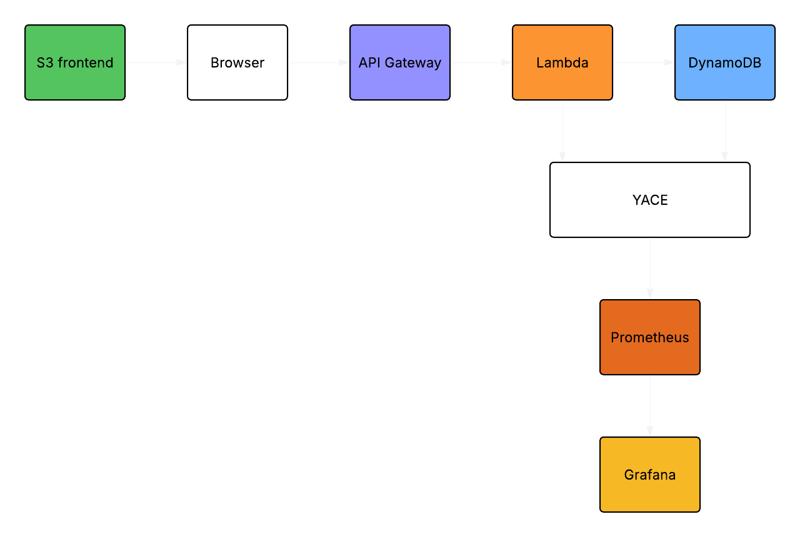

# Serverless URL Shortener with Full Observability on AWS

A production-style serverless URL shortener built to demonstrate DevOps and Platform Engineering skills — IaC, least-privilege IAM, and a full observability stack.

## Architecture

## Stack

- **API Gateway (HTTP API)** — exposes `POST /shorten` and `GET /{code}`
- **Lambda (Python 3.12)** — business logic for creating and resolving short URLs
- **DynamoDB (On-Demand)** — stores `shortCode → originalUrl` mappings with TTL
- **S3** — hosts a minimal HTML/JS frontend
- **CloudWatch** — Lambda and DynamoDB metrics, logs, and alarms
- **YACE** — scrapes CloudWatch metrics and exposes them as Prometheus targets
- **Prometheus** — scrapes and stores metrics from YACE
- **Grafana** — dashboards for Lambda invocations, error rates, duration, and DynamoDB capacity

## Project Structure

    url-shortener/
    ├── infra/
    │   ├── main.tf
    │   ├── variables.tf
    │   ├── outputs.tf
    │   └── lambda/
    │       ├── create/lambda_function.py
    │       └── redirect/lambda_function.py
    ├── observability/
    │   ├── docker-compose.yaml
    │   ├── yace-config.yaml
    │   └── prometheus.yaml
    ├── frontend/
    │   └── index.html
    └── README.md

## How It Works

**Creating a short URL:**
1. User opens the frontend served from S3
2. Browser sends `POST /shorten` to API Gateway
3. Lambda hashes the URL using SHA-256 and takes the first 7 characters as the short code
4. Writes `{ shortCode, originalUrl, createdAt, ttl }` to DynamoDB
5. Returns the short URL to the browser

**Visiting a short URL:**
1. Browser hits `GET /{code}` on API Gateway
2. Lambda does a `GetItem` on DynamoDB using the code
3. Returns a `301` redirect with the original URL in the `Location` header
4. Browser follows the redirect automatically

## Deploy

All AWS resources are managed via Terraform — no manual console setup required.

**Resources provisioned (19 total):**
- DynamoDB table with TTL enabled
- IAM role with least-privilege permissions (`PutItem`, `GetItem` only)
- Lambda functions (`create` and `redirect`)
- API Gateway HTTP API with CORS
- CloudWatch alarms (error rate, throttles, DynamoDB system errors)

    cd infra/
    terraform init
    terraform apply

The API Gateway invoke URL is automatically wired into the Lambda environment — no manual updates needed across destroy/apply cycles.

    terraform destroy

## Observability Stack

Runs on a single EC2 t3.micro via Docker Compose. Spin it up only when needed to stay within free tier.

    cd observability/
    export AWS_ACCESS_KEY_ID=...
    export AWS_SECRET_ACCESS_KEY=...
    docker compose up -d

- **Grafana** → `http://<EC2_IP>:3000`
- **Prometheus** → `http://<EC2_IP>:9090`

### Grafana Dashboards

| Panel | Metric | Purpose |
|---|---|---|
| Lambda Invocations | `aws_lambda_invocations_sum` | Request volume |
| Lambda Errors | `aws_lambda_errors_sum` | Error rate |
| Lambda Duration | `aws_lambda_duration_average` | Latency |
| DynamoDB Read Capacity | `aws_dynamodb_consumed_read_capacity_units_sum` | Read load |
| DynamoDB Write Capacity | `aws_dynamodb_consumed_write_capacity_units_sum` | Write load |

## CloudWatch Alarms

| Alarm | Condition |
|---|---|
| `url-shortener-create-ErrorRate` | Errors > 5 in 5 minutes |
| `url-shortener-redirect-ErrorRate` | Errors > 5 in 5 minutes |
| `url-shortener-create-Throttles` | Throttles ≥ 1 in 1 minute |
| `url-shortener-redirect-Throttles` | Throttles ≥ 1 in 1 minute |
| `url-shortener-DynamoDB-SystemErrors` | System errors ≥ 1 in 1 minute |

## IAM Design

Least-privilege principle applied throughout:

- **Lambda role** — only `dynamodb:PutItem` and `dynamodb:GetItem` on the specific table ARN
- **YACE IAM user** — only CloudWatch read permissions and `iam:ListAccountAliases`
- **Terraform deployer** — separate IAM user used only for `terraform apply`
